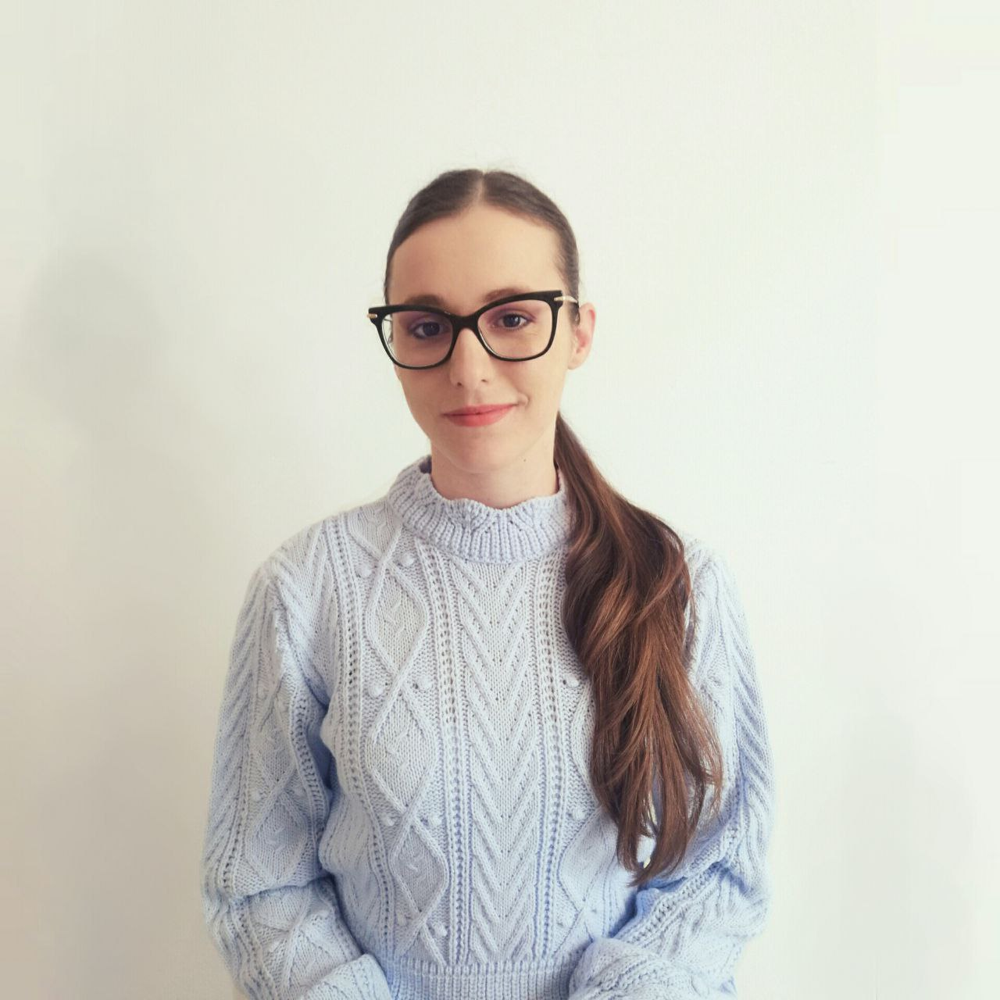

# Matea Turalija

- Research and teaching assistant at [University of Rijeka](https://uniri.hr/en/) [Faculty of Medicine](https://medri.uniri.hr/en/)
- Ph.D. student of [informatics](https://www.inf.uniri.hr/en/study-programmes/university-postgraduate-doctoral-study-informatics) at [University of Rijeka](https://uniri.hr/en/) [Faculty of Informatics and Digital Technologies](https://www.inf.uniri.hr/en/)
- Member of [Group for Applications and Services on Exascale Research Infrastructure (GASERI)](https://group.miletic.net/en/)

## Scientific interests

- Quantum and classical mechanics of atoms and molecules, molecular dynamics simulation
- Parallel and distributed computing, algorithms on exascale supercomputers

## PhD research progress

- 2023-11-12: presented at [2nd Scientific Conference of Doctoral Students of Informatics: INFCON23](https://inf.uniri.hr/images/studiji/poslijediplomski/INFCON/2023/Infcon_2023_program.pdf) ([proceedings](https://www.inf.uniri.hr/images/studiji/poslijediplomski/INFCON/2023/Infcon_proc_2023.pdf))
- 2022-15-12: passed [Doctoral qualification exam](https://www.inf.uniri.hr/studiji/poslijediplomski-studij/obavijesti-doktorskog-studija/1166-kvalifikacijski-doktorski-ispit-kandidatkinje-matee-turalije) ([paper](https://www.inf.uniri.hr/images/studiji/poslijediplomski/kvalifikacijski/Turalija_Matea.pdf))
- 2022-11-11: presented at [1st Scientific Conference of Doctoral Students of Informatics: INFCON22](https://www.inf.uniri.hr/images/studiji/poslijediplomski/INFCON/Infcon_2022_program.pdf) ([proceedings](https://www.inf.uniri.hr/images/studiji/poslijediplomski/INFCON/Infcon_proc_2022_FIN.pdf))

## Publications

1. **Turalija, M.**, Petrović, M. & Kovačić, B. [Towards General-Purpose Long-Timescale Molecular Dynamics Simulation on Exascale Supercomputers with Data Processing Units.](https://ieeexplore.ieee.org/document/9803537) in 2022 45th International Convention on Information, Communication, and Electronic Technology (MIPRO), 300–306 (2022). [doi:10.23919/MIPRO55190.2022.9803537](https://doi.org/10.23919/MIPRO55190.2022.9803537)

## Co-authored talks

1. [Molecular dynamics simulation for exascale supercomputing era: scientific research and software engineering challenges](https://group.miletic.net/en/talks/2023-09-16-molecular-dynamics-simulation-for-exascale-supercomputing-era-scientific-research-and-software-engineering-challenges/). Presented by [Vedran](https://vedran.miletic.net/) [Miletić](https://www.miletic.net/). Invited lecture at the [Computational Chemistry Day](https://www.compchemday.org/) in Zagreb, Croatia, 16th of September, 2023.
1. [Extending Non-Equilibrium Pulling Method in GROMACS with Arbitrary User-Defined Atom Weight Factor Expressions](https://group.miletic.net/en/talks/2022-09-23-extending-non-equilibrium-pulling-method-in-gromacs-with-arbitrary-user-defined-atom-weight-factor-expressions/). Presented by [Vedran](https://vedran.miletic.net/) [Miletić](https://www.miletic.net/). [Third Infinity](https://thirdinfinity.mpg.de/) [2022](https://thirdinfinity.mpg.de/2022/), [Max Planck Institute for Multidisciplinary Sciences](https://www.mpinat.mpg.de/en), Göttingen, 23rd of September 2022

## Research projects

- [Measuring the Social Dimension of Culture (MESOC)](https://mesoc-project.eu/), [Horizon 2020](https://cordis.europa.eu/project/id/870935) (researcher)

## Teaching activities

### Current

- Medical Informatics (Medicine)
- [Informatics for Pharmacists](https://group.miletic.net/hr/nastava/kolegiji/INF-Pharma/) (Pharmacy)
- Health Informatics (Environmental and Public Health)
- Medical Informatics (Medical Laboratory Diagnostics)

### Previous

- [Computer Architecture and Organization](https://group.miletic.net/hr/nastava/kolegiji/AOR/) (auditory exercises)
- [Computer Networks](https://group.miletic.net/hr/nastava/kolegiji/RM/) (laboratory exercises)
- [Network and Mobile Operating Systems](https://group.miletic.net/hr/nastava/kolegiji/MMOS/) (auditory exercises)

## Popularization of science

- [Radionica: Izradite svoj web u 4 sata!](https://udruga-penkala.hr/radionica-izradite-svoj-web-u-4-sata/2024/)
- [Otvoreni dan Tetragon 2023](https://www.inf.uniri.hr/znanstveni-i-strucni-rad/dogadanja/1247-otvoreni-dan-tetragon-2023)
- [Build your Career Garden](https://www.inf.uniri.hr/znanstveni-i-strucni-rad/dogadanja/1236-nastavnici-fidit-a-drze-predavanje-i-radionicu-na-build-your-career-garden)
- [Rijeka tehnologije 2023](https://inf.uniri.hr/images/naslovnica/2023/Dan_3_Program_RT2023.pdf)
- [Scientific laboratory (physics)](https://dom-mladih.hr/aktivnosti/) at [Dom mladih](https://dom-mladih.hr/)

## Social networks

- [LinkedIn](https://www.linkedin.com/in/mateaturalija/)
- [ORCID](https://orcid.org/0000-0002-0109-1245)
- [Google Scholar](https://scholar.google.com/citations?user=C03KugcAAAAJ)
- [GitHub](https://github.com/MateaTuralija)
- [GitLab](https://gitlab.com/MateaTuralija)
